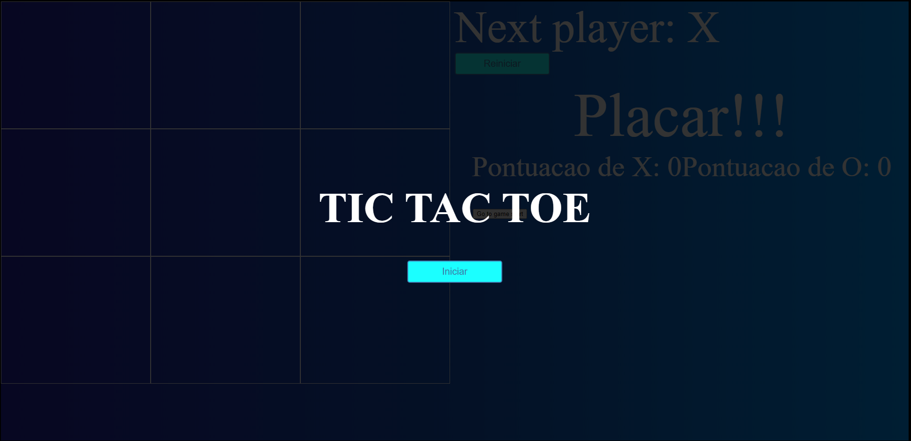
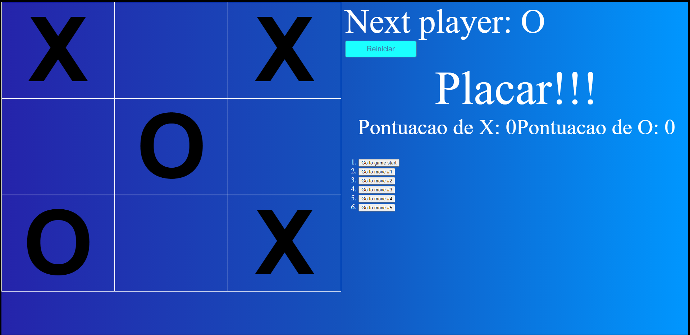
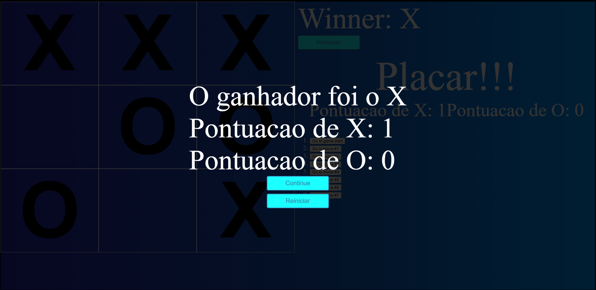

# TIC-TAC-TOE

# Sobre o projeto

Jogo da velha aprimorado, versão inicial é o exemplo do site do react(https://pt-br.reactjs.org/).

## Imagens do jogo

### menu



### jogo



### placar



# 🚀 Começando

Essas instruções permitirão que você obtenha uma cópia do projeto em operação na sua máquina local para fins de desenvolvimento e teste.

## 📋 Pré-requisitos

- npm / yarn

## 🔧 Instalação
### :warning::warning: **A pasta img-jogo**: é para guardar as imagens usadas no readme.md! Apagar ela depois do clone :warning::warning:
``` bash
### clonar repositório
git clone https://github.com/PauloCSantos/tic-tac-toe.git

## entrar na pasta do projeto
cd my-app

## instalar as dependencias
npm install

## executar o projeto
npm start
```

## 🛠️ Construído com

- HTML / CSS / 
- ReactJS

## ✒️ Autor

* **Paulo C Santos** - [Linkedin](https://www.linkedin.com/in/paulocsantos1995/)
